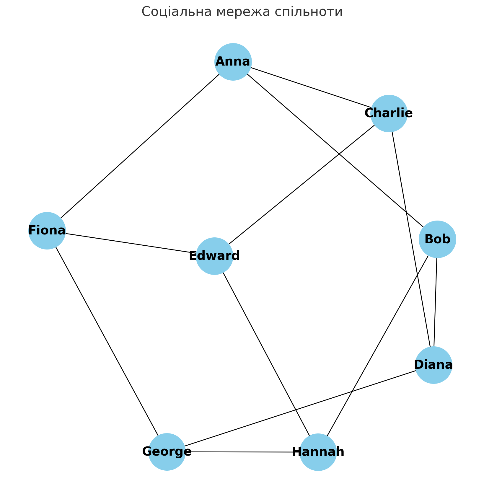
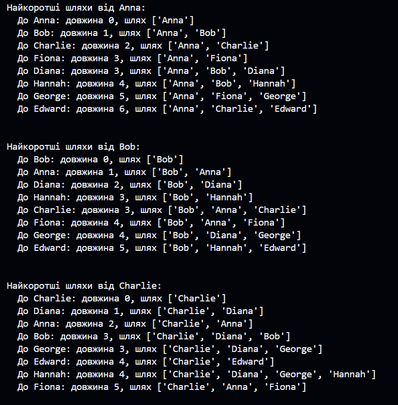
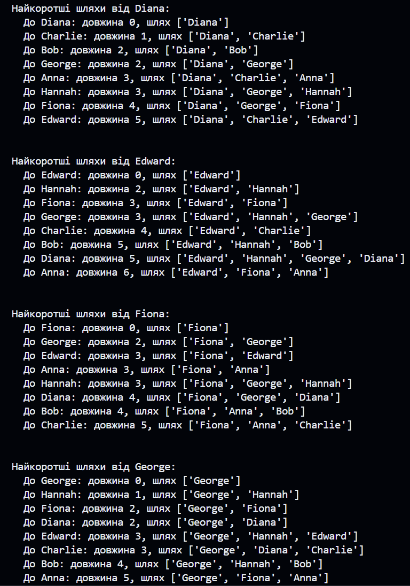

# goit-algo-hw-06
## Завдання 1
Давайте створимо модель соціальної мережі за допомогою бібліотеки NetworkX в Python. Ця соціальна мережа буде представляти друзів і знайомих у невеликій спільноті. Ми визначимо кілька основних учасників і їхні взаємозв'язки, а потім візуалізуємо цю мережу. Також проведемо аналіз основних характеристик мережі.

Спочатку створимо граф, де вершини представляють осіб, а ребра — їхні взаємозв'язки. Потім візуалізуємо цей граф і проаналізуємо такі характеристики, як кількість вершин і ребер, середній ступінь вершин, і можливо, знайдемо центральні вузли в мережі.

Візуалізація показує структуру модельної соціальної мережі спільноти, де вершини відображають осіб, а ребра — їхні взаємозв'язки. Ось основні характеристики цієї мережі:

- Кількість вершин (учасників мережі): 8
- Кількість ребер (взаємозв'язків): 12
- Середній ступінь вершин: 3.0
- Максимальний ступінь вершин: 3
- Мінімальний ступінь вершин: 3 

Кожен учасник мережі має взаємозв'язки з трьома іншими особами, що демонструє досить однорідну структуру зв'язків у цій соціальній мережі. Це може свідчити про тісний коло знайомств у відносно ізольованій спільноті або групі.

## Завдання 2 
### Використання DFS і BFS для знаходження шляхів від "Anna" до "George"

DFS може знайти довші шляхи до кінцевої вершини, в той час як BFS зосереджений на виявленні найкоротшого шляху.

DFS шляхи:
* ['Anna', 'Fiona', 'George']
* ['Anna', 'Fiona', 'Edward', 'Charlie', 'Diana', 'George']
* ['Anna', 'Fiona', 'Edward', 'Charlie', 'Diana', 'Bob', 'Hannah', 'George']
* ['Anna', 'Fiona', 'Edward', 'Hannah', 'George']
* ['Anna', 'Fiona', 'Edward', 'Hannah', 'Bob', 'Diana', 'George']
* ['Anna', 'Charlie', 'Edward', 'Fiona', 'George']
* ['Anna', 'Charlie', 'Edward', 'Hannah', 'George']
* ['Anna', 'Charlie', 'Edward', 'Hannah', 'Bob', 'Diana', 'George']
* ['Anna', 'Charlie', 'Diana', 'George']
* ['Anna', 'Charlie', 'Diana', 'Bob', 'Hannah', 'George']
* ['Anna', 'Charlie', 'Diana', 'Bob', 'Hannah', 'Edward', 'Fiona', 'George']
* ['Anna', 'Bob', 'Hannah', 'George']
* ['Anna', 'Bob', 'Hannah', 'Edward', 'Charlie', 'Diana', 'George']
* ['Anna', 'Bob', 'Hannah', 'Edward', 'Fiona', 'George']
* ['Anna', 'Bob', 'Diana', 'George']
* ['Anna', 'Bob', 'Diana', 'Charlie', 'Edward', 'Fiona', 'George']
* ['Anna', 'Bob', 'Diana', 'Charlie', 'Edward', 'Hannah', 'George']

BFS шляхи:
* ['Anna', 'Fiona', 'George']
* ['Anna', 'Bob', 'Diana', 'George']
* ['Anna', 'Bob', 'Hannah', 'George']
* ['Anna', 'Charlie', 'Diana', 'George']
* ['Anna', 'Charlie', 'Edward', 'Hannah', 'George']
* ['Anna', 'Charlie', 'Edward', 'Fiona', 'George']
* ['Anna', 'Fiona', 'Edward', 'Hannah', 'George']
* ['Anna', 'Bob', 'Hannah', 'Edward', 'Fiona', 'George']
* ['Anna', 'Charlie', 'Diana', 'Bob', 'Hannah', 'George']
* ['Anna', 'Fiona', 'Edward', 'Charlie', 'Diana', 'George']
* ['Anna', 'Bob', 'Diana', 'Charlie', 'Edward', 'Hannah', 'George']
* ['Anna', 'Bob', 'Diana', 'Charlie', 'Edward', 'Fiona', 'George']
* ['Anna', 'Bob', 'Hannah', 'Edward', 'Charlie', 'Diana', 'George']
* ['Anna', 'Charlie', 'Edward', 'Hannah', 'Bob', 'Diana', 'George']
* ['Anna', 'Fiona', 'Edward', 'Hannah', 'Bob', 'Diana', 'George']
* ['Anna', 'Charlie', 'Diana', 'Bob', 'Hannah', 'Edward', 'Fiona', 'George']
* ['Anna', 'Fiona', 'Edward', 'Charlie', 'Diana', 'Bob', 'Hannah', 'George']\

